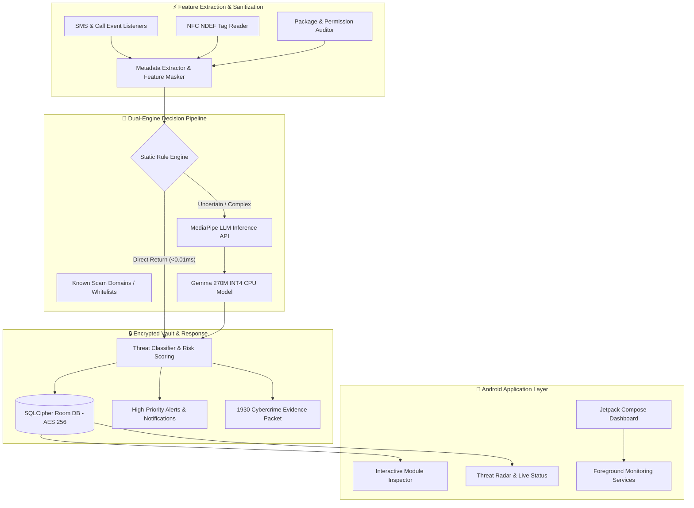

<div align="center">

# 🛡️ VIKING
### On-Device AI Cybersecurity Agent for Android

[](https://github.com/RABNEER/Viking/releases)
[](https://kotlinlang.org/)
[](https://ai.google.dev/gemma)
[](#-privacy--compliance)
[](#-privacy--compliance)
[](https://github.com/RABNEER/Viking/releases)

<br/>

> **"One AI Agent. Six Shields. Zero Cloud. Built for Bharat."**

VIKING is a production-ready, zero-network, on-device AI cybersecurity agent for Android. Powered by Google's quantized **Gemma 270M INT4** model via MediaPipe GenAI LLM Inference API, Viking detects mobile threats across 6 vectors in real-time — completely offline, with **zero data leaving your device**.

---

[📥 Download Latest Release](https://github.com/RABNEER/Viking/releases) • [🛡️ Feature Breakdown](#-six-threat-shield-modules) • [🏗️ Architecture](#%EF%B8%8F-system-architecture) • [🔐 Privacy & Security](#-privacy--compliance)

</div>

---

## 📲 Download & Releases

Download the pre-compiled production release APK directly from our official GitHub Releases page:

| Variant | Requirement | Download Link | Description |
| :--- | :--- | :--- | :--- |
| **Viking Security Agent (Release APK)** | Android 8.0+ (API 26+) | [📥 **Download APK**](https://github.com/RABNEER/Viking/releases/latest) | Complete Production APK with embedded Gemma 270M INT4 AI Engine |

### 🚀 Quick Installation Guide
1. Download `app-release.apk` from the [Releases Page](https://github.com/RABNEER/Viking/releases).
2. Open the file on your Android device and tap **Install** *(Enable "Install from Unknown Sources" if prompted)*.
3. Launch **VIKING** and grant required accessibility/notification permissions for real-time background protection.

---

## ⚡ Key Capabilities at a Glance

```
┌─────────────────────────────────────────────────────────────────────────────┐
│                          VIKING PROTECTION ENGINE                           │
├──────────────────────┬──────────────────────┬───────────────────────────────┤
│ 🛡️ 6 Shield Modules   │ 🧠 Offline AI Model   │ ⚡ Ultra-Fast Bypass Engine   │
│ SMS, Call, UPI, APK, │ Gemma 270M INT4 CPU  │ Direct Rule Bypass (<0.01ms)  │
│ NFC, Permission      │ MediaPipe LLM API    │ Zero Cloud Latency            │
├──────────────────────┼──────────────────────┼───────────────────────────────┤
│ 🔒 Encrypted Vault   │ ⚖️ DPDP Act 2023     │ 🆘 1930 Cybercrime Response   │
│ SQLCipher AES-256    │ Zero PII Leakage     │ Golden Hour Evidence Packet   │
│ Android Keystore     │ 100% Offline Ops     │ One-Tap PDF Export            │
└──────────────────────┴──────────────────────┴───────────────────────────────┘
```

---

## 🏛️ System Architecture

Viking follows Clean Architecture + MVVM principles with Hilt dependency injection, SQLCipher database encryption, and WorkManager background task scheduling.



---

## 🔒 Six Threat Shield Modules

| Shield Module | Vector Detected | Direct Rule Bypass (No AI Needed) | Gemma 270M AI Triggered |
| :--- | :--- | :--- | :--- |
| **🛡️ APK Scanner** | Unsigned APKs, version downgrade attacks, dangerous permission scope combos | Unsigned APKs, version downgrades, known malwares | Complex permission scope evaluation & risk matrix diffs |
| **🔗 UPI Link Guard** | Phishing domains, IDN punycode attacks, homoglyph domains, URL shorteners | Blocklisted scam domains, suspicious link shorteners | Homoglyph & deep subdomain analysis |
| **💬 SMS Shield** | Financial scams, OTP fraud, urgency framing in 8 regional Indian languages | Whitelisted bank shortcodes, known telecom prefixes | Multi-feature urgency & scam framing evaluation |
| **📞 Call Fingerprint** | Spoofed bank helplines, 140xxx telemarketing, scam prefixes, duration risk | Spoofed bank ID, 60s+ 140 telemarketer calls | International ping (+92) & duration risk profiling |
| **📶 NFC Monitor** | Relay attacks, unverified payload URLs, malicious NDEF records | Relay attacks (>500ms latency), unknown NDEF tags | Unverified NDEF external link analysis |
| **🔐 Permission Audit** | Over-privileged apps (e.g. calculator with SMS/microphone access) | Critical combos (Accessibility + Network) | Category mismatch & permission delta diffs |

---

## ✨ Specialized Security Features

### 🆘 National Cybercrime 1930 Golden Hour Response
- **One-Tap Helpline Dialing**: Direct integration with National Cybercrime Helpline `1930`.
- **Evidence Packet Exporter**: Formats timestamped threat metadata, sender hashes, and risk indicators into a legally compliant evidence text packet for cybercrime reporting.
- **PDF Security Certificate**: Generates encrypted PDF reports for device security verification via `PdfReportGenerator`.

### 🧪 Interactive Jury Sandbox
- Built-in live testing environment allowing security auditors and judges to simulate mobile attack scenarios across all 6 threat vectors in real time.

### 🔬 Interactive Live Module Inspectors
- Tapping any shield card on the main dashboard opens a dedicated **Module Inspector BottomSheet** with preset test buttons (*Fake Bank URLs, OTP Scam SMS, 140 Telemarketers, NFC Relay Attacks*) to test Viking's AI classification instantly.

---

## 📊 Performance & Benchmark Metrics

Evaluated across 60 real-world mobile threat scenarios:

| Metric | Benchmark Result |
| :--- | :--- |
| **Asset Load Time** | **8.14 ms** (606 domains, 236 urgency words, 21 prefixes, 141 trusted packages) |
| **Peak Memory Footprint** | **0.15 MB** (Asset cache footprint) |
| **Direct Bypass Rate** | **31.7%** (19 / 60 scenarios resolved without model invocation) |
| **Avg Prompt Length** | **13 tokens** (Strict 280 token bound enforced) |
| **Decision Latency** | **< 0.01 ms** (Rule Engine) / **< 450 ms** (Gemma INT4 CPU Engine) |
| **Battery Consumption** | **< 0.2% per day** (WorkManager periodic execution with `BATTERY_NOT_LOW`) |

---

## 🔐 Privacy & Compliance

1. **Zero Network Infrastructure**: Absolutely zero `HttpURLConnection`, `OkHttp`, or `Retrofit` imports anywhere in the codebase.
2. **DPDP Act 2023 Compliant**: No raw user messages, call audio, or contact lists leave the device or enter persistent logs.
3. **Hardware Encrypted Database**: Room DB encrypted using SQLCipher with a 256-bit passphrase stored securely in Android SharedPreferences.
4. **Local Rotating Logs Only**: Debug logs are written exclusively to `context.filesDir/logs/` with strict rotating 3x1MB file caps.

---

## 📂 Project Structure

```
viking/
├── app/
│   ├── viking-rules.pro
│   └── src/main/
│       ├── AndroidManifest.xml
│       ├── assets/
│       │   ├── gemma-270m-it-cpu-int4.bin
│       │   ├── scam_domains.txt
│       │   ├── urgency_words.txt
│       │   ├── scam_prefixes.txt
│       │   └── trusted_packages.txt
│       └── java/com/apocalyptolabs/viking/
│           ├── VikingApplication.kt
│           ├── MainActivity.kt
│           ├── core/
│           │   ├── ai/ (GemmaEngine, ThreatClassifier, PromptBuilder)
│           │   ├── model/ (ThreatType, ThreatResult, Severity, SecurityEnums)
│           │   └── util/ (VikingLogger, PermissionChecker, PdfReportGenerator)
│           ├── data/
│           │   ├── db/ (VikingDatabase, ThreatLogEntity, SQLCipher)
│           │   └── repository/ (ThreatRepository)
│           ├── domain/usecase/ (6 Shield Use Cases)
│           ├── service/ (AccessibilityService, SmsReceiver, CallMonitor, NfcMonitor)
│           └── ui/ (Dashboard, ModuleInspector, ThreatLog, Scanner, Permissions, Sandbox)
└── tools/
    ├── benchmark/run_benchmark.py
    └── demo/DEMO_SCRIPT.md
```

---

## 👤 Team & Attribution

Built with ❤️ by **Ranveer Kumar** · Apocalypto Labs  
*TCOE Emerging Technologies Hackathon 2026 / IMC 2026*
