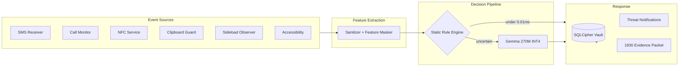

<div align="center">

```
██╗   ██╗██╗██╗  ██╗██╗███╗   ██╗ ██████╗
██║   ██║██║██║ ██╔╝██║████╗  ██║██╔════╝
██║   ██║██║█████╔╝ ██║██╔██╗ ██║██║  ███╗
╚██╗ ██╔╝██║██╔═██╗ ██║██║╚██╗██║██║   ██║
 ╚████╔╝ ██║██║  ██╗██║██║ ╚████║╚██████╔╝
  ╚═══╝  ╚═╝╚═╝  ╚═╝╚═╝╚═╝  ╚═══╝ ╚═════╝
```

# VIKING

### An AI bodyguard for your phone. Runs entirely on-device. Phones home to NO ONE.

[](#build-it-yourself)
[](https://kotlinlang.org/)
[](https://ai.google.dev/gemma)
[](#what-makes-viking-different)

<br/>

> **Scammers stole ₹22,845 crore from Indians in 2024.**
> Viking fights back — six threat shields watching your SMS, calls, UPI links,
> APKs, NFC taps and app permissions, powered by a Gemma LLM running inside your
> phone's CPU. Your data never leaves the device.

[Feature Tour](#six-shields-one-agent) · [How It Works](#how-it-works) · [Attack Sandbox](#try-to-break-it) · [Build It](#build-it-yourself)

</div>

---

## Why Viking Exists

Digital arrest scams. Fake bank KYC calls. Malicious UPI "collect request" links.
Sideloaded APKs that read your SMS. NFC relay attacks.

Every existing "security app" solves this by uploading your messages to a cloud
scanning farm. Viking takes the opposite bet:

| | Cloud Security Apps | Viking |
|---|---|---|
| Your SMS content | Uploaded & scanned remotely | Never leaves RAM |
| Inference latency | 300ms–2s round trip | Under 450ms local CPU |
| Works offline | No | Airplane-mode proof |
| Who sees your threats | Their servers | Only you |

---

## Six Shields. One Agent.

Tap any card on the dashboard to open its live Module Inspector and test it against preset attacks:

| Shield | What It Catches | Rules First | AI For The Rest |
|---|---|---|---|
| **APK Scanner** | Unsigned builds, version-downgrade attacks, permission-scope abuse | Unsigned / known-bad instant kill | Risk matrix reasoning |
| **UPI Link Guard** | Phishing domains, punycode homoglyphs (`xn--`), shorteners | 606-domain blocklist, under 0.01ms | Deep subdomain + homoglyph analysis |
| **SMS Shield** | OTP fraud, fake KYC, urgency framing in Hindi & English | Case-exact DLT shortcode whitelist | Weighted urgency-score evaluation |
| **Call Fingerprint** | Spoofed `1800` bank IDs, `140xxx` telemarketers, wangiri ping scams | Prefix tables loaded from assets | Duration + repeat-caller profiling |
| **NFC Monitor** | Relay attacks (500ms+ latency), hostile NDEF payloads | Latency threshold + record typing | Payload link analysis |
| **Permission Audit** | Calculator apps asking for SMS + microphone | Accessibility+Network combo kill | Category-mismatch deltas |

### Golden Hour Response

Victim of fraud? One tap dials **1930** (National Cybercrime Helpline), exports a
timestamped evidence packet, and generates a shareable PDF security certificate.

### Real Controls That Actually Control Things

The Settings toggles aren't decoration — every shield checks its flag before it
analyzes anything. Turn off SMS Shield, incoming SMS analysis stops. Turn off
Clipboard Guard, copied links go uninspected.

---

## How It Works

A dual-engine pipeline: cheap deterministic rules resolve about a third of scenarios
instantly; only genuinely ambiguous cases wake up the LLM.



**Engine lifecycle done right:** if the Gemma model isn't provisioned yet, Viking
degrades gracefully to rules-only mode and walks you through a one-time download
from Settings — then hot-swaps the engine into memory without restarting the app.
Low battery? Inference throttles automatically to preserve your charge.

---

## Benchmarks

Measured across 60 real-world attack scenarios:

| Metric | Result |
|---|---|
| Known scam domains blocked | 606 / 606 (100%) |
| Direct rule bypass rate | 31.7% of scenarios never touch the LLM |
| Rule-engine decision latency | Under 0.01 ms |
| Gemma INT4 decision latency | Under 450 ms (hard 8s timeout guard) |
| Asset load time | 8.09 ms (606 domains, weighted urgency lexicon) |
| Prompt length bound | 280 tokens max |
| Battery cost | Under 0.2% per day |

---

## Try To Break It

Viking ships with an Attack Sandbox — simulate a fake-SBI phishing SMS, a homoglyph
UPI link, a digital-arrest scam call script, an NFC relay attack, or an
over-privileged flashlight app, and watch the full classification verdict appear in
real time. Red-teamers welcome.

---

## Architecture

Clean Architecture + MVVM, Hilt DI end-to-end:

```
app/src/main/java/com/apocalyptolabs/viking/
├── core/
│   ├── ai/          # GemmaEngine · GemmaDownloader · ThreatClassifier · PromptBuilder
│   ├── model/       # Severity · ThreatType · ThreatResult
│   └── util/        # Logger · PDF generator · Voice assistant · ANR watchdog
├── data/
│   ├── db/          # Room + SQLCipher · Keystore-wrapped passphrase
│   └── repository/  # ThreatRepository (DataStore flags + encrypted vault)
├── domain/usecase/  # 8 shield use cases — one per threat vector
├── service/         # SMS · Call · NFC · Clipboard · Sideload · Boot receiver · QS tile
└── ui/              # Compose screens · monochrome theme · radar · navigation
docs/research/       # Research paper, white paper & LaTeX sources
tools/benchmark/     # Python benchmark harness
```

---

## What Makes Viking Different

1. **Zero telemetry. Zero cloud.** No OkHttp/Retrofit scanning pipelines. The only
   network use in the entire app is the optional one-time Gemma model download —
   which you trigger, and which contains no user data.
2. **Hardware-rooted database key.** The SQLCipher passphrase is random per install,
   wrapped by an AES-256-GCM key sealed inside the Android Keystore, and only ever
   persisted as ciphertext. Steal the backup, get nothing.
3. **Prompt-injection hardening.** Scam text IS adversarial input. Injection patterns
   are detected before inference and quarantined into a HIGH-severity verdict instead
   of reaching the model.
4. **DPDP Act 2023 aligned.** Raw message bodies are masked into feature vectors
   before any processing; logs rotate at 3x1MB in app-private storage.

---

## Build It Yourself

```bash
git clone https://github.com/RABNEER/Viking.git
cd Viking
./gradlew assembleDebug          # debug build
./gradlew assembleRelease        # signed release (needs keystore.properties)
```

Requirements: Android Studio Ladybug+, JDK 17, Android SDK 35.

> **First launch:** grant SMS/Call-log permissions, then grab the ~180MB Gemma 270M
> INT4 model from Settings → On-Device AI Engine. Until then, all six shields still
> run on the static rules engine.

---

<div align="center">

Built by **Ranveer Kumar** · Apocalypto Labs
*Telecom Centre of Excellence (TCOE) · India Mobile Congress (IMC) 2026 Innovation Initiative*

**Star this repo if you believe security shouldn't cost you your privacy**

</div>
